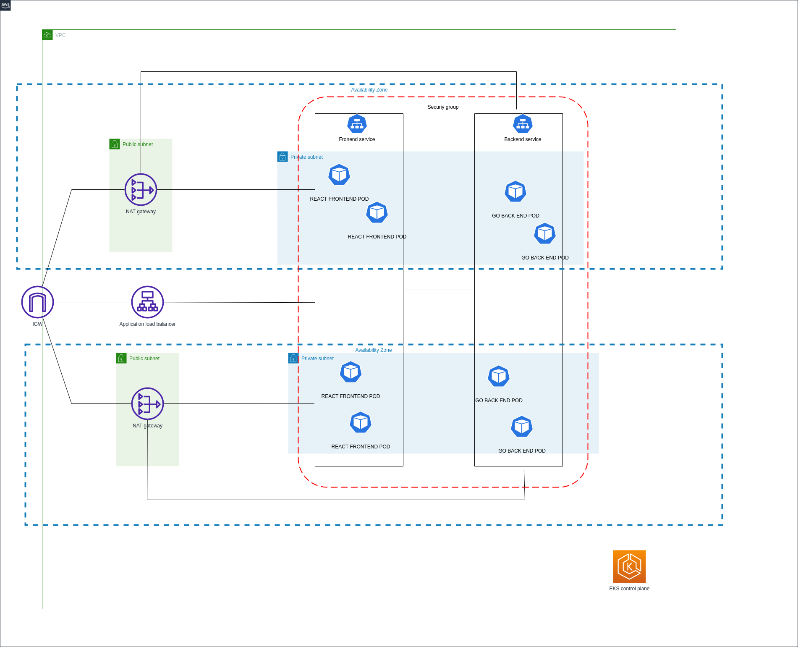

# TransportOptimizer: Efficient Trip Planning Application
## Description

TransportOptimizer assists users in efficiently planning their travel route by sequencing their desired destinations. Leveraging the modified Traveling Salesman Problem (TSP) algorithm, it lets users apply optional constraints, such as mandating the sequence of specific locations. We harness the power of the Google Maps API to determine the shortest paths between destinations.

## Tech stack
- ReactJS - Frontend
- Go - Backend
- Docker
- K8s/EKS
- Terraform
- Github Actions - CI/CD

## Architecture

Frontend: Built with ReactJS.

Backend: Developed in Go to compute TSP algorithm.

Our system architecture follows a microservices pattern, hosted on Amazon Elastic Kubernetes Service (EKS), a managed Kubernetes service. We've ensured scalability by automating the scaling of the Kubernetes control plane with EKS.

Furthermore, we've adopted a principled approach to infrastructure management using Infrastructure as Code (IaC) with Terraform. 

The GitHub Actions CI/CD pipeline also keep tracks of changes in the files, and will either publish images to DockerHub or EKS infrastructure by applying changes in the new files Terraform and K8s.





## Run locally with Docker
You need to first the following environment variables

| Variable Name           | Description                                                                                                 |
|-------------------------|-------------------------------------------------------------------------------------------------------------|
| REACT_APP_GOOGLE_MAPS_API_KEY            | Google Maps API |

Run in development mode 
```
docker compose up
```

Run in production mode
```
docker compose -f docker-compose.prod.yml up
```

## Deploy to K8s cluster
You first need to connect your to the K8s cluster, e.g.

```
aws eks update-kubeconfig --name _your_eks_cluster_name
```

or create your own local cluster, e.g.

```
k3d create cluster _your_cluster_name
```

The k8s cluster will pull the images from DockerHub. After that, apply the k8s files with the environment variables using
```
helm upgrade --install transport-optimizer ./app-chart
```


